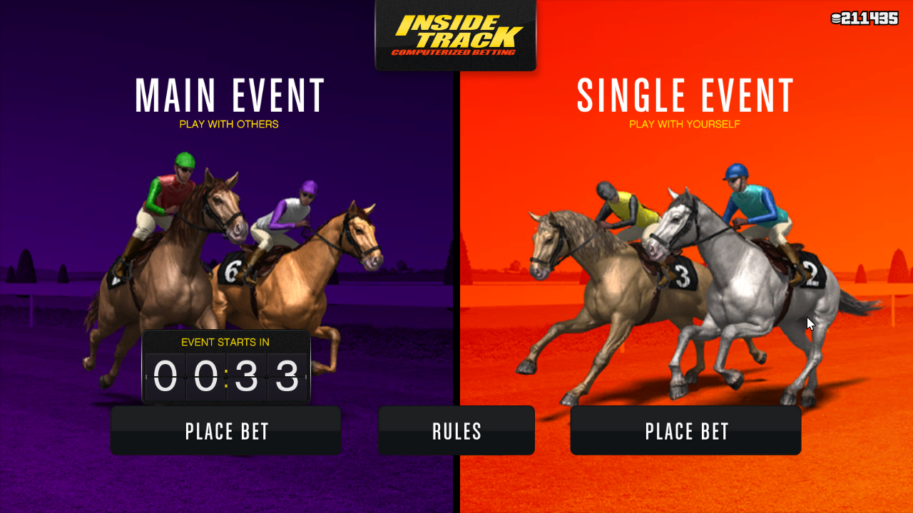

# GTA Online Autobettor

Autobettor for GTA Online's Inside Track (horse racing) casino minigame. This script averages GTA$200k/hr or so with a high variance. The in-game text is read with a specifically trained, highly accurate AI model.

## Installation and Usage

You need to have Python <= 3.7 and pip installed.

In your preferred terminal, after running `git clone`, simply run the following:

```
pip install -r requirements.txt
python -m autobet
```

Start the game (windowed mode is preferred as it has less graphics lag). Make sure it is running at an aspect ratio of 16:9. Then, enter the casino and start the minigame. You should be at the following screen:



Then, press **F8** to start the program. Leave the game running in the foreground. You can check your earnings in the terminal output.

You can press **F8** again to stop the program. However if the Python main thread is running, it won't stop immediately. You can simply press Ctrl+C in the terminal to stop it.

## Note

- I'm not responsible if you get banned from this. However, this program does not modify the game in any way and only simulates mouse and keyboard inputs.

- The OCR program [tesseract](https://github.com/tesseract-ocr/tesseract)that reads the winnings is not very good and makes errors sometimes. This means that your total earnings will be slightly higher than what is shown.

- There are other similar programs available ([1](https://github.com/list12356/gta_casino_script), [2](https://github.com/MarkusJx/autobet)). This program was written to be simpler and easier to understand and tweak.

## Development

- Check out `autobet/bettor.py` if you want to change the betting strategy.

- To train your own model, check out `train_ocr.ipynb`.
